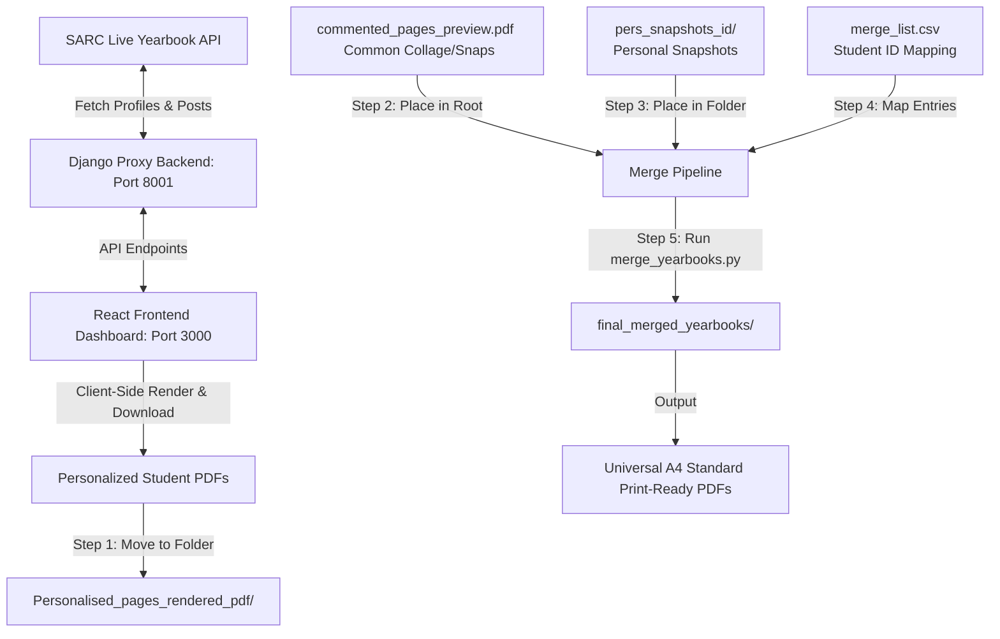

# IIT Bombay SARC Yearbook 2026 PDF Rendering & Merging Pipeline

This repository contains the complete codebase for generating, rendering, and merging personalized yearbooks for the IIT Bombay SARC Yearbook 2026. The pipeline consists of a React-based frontend dashboard, a Django-based backend API proxy, and a Python merging script that combines everything into high-fidelity, print-ready A4 PDFs.

---

## 📖 Architecture & Workflow Overview

To bypass heavy server-side PDF rendering loads and API CORS limitations, the yearbook rendering pipeline uses a hybrid client-server and script-based architecture:



### The 3 Core Components:
1. **Django Proxy Backend (`YB-pdf-backend-main`)**:
   - Acts as a proxy to fetch profile data and written posts from the live SARC Yearbook servers (preventing CORS blocks).
   - Serves the yearbook student list from a local CSV (`yearbooks-ids_2026.csv`) to populate the dashboard.
   - Runs by default on **Port 8001**.
2. **React Frontend Dashboard (`YB-pdf-frontend-main`)**:
   - Provides an interactive dashboard (`localhost:3000`) listing all yearbook students.
   - When you click **Render**, it uses `@react-pdf/renderer` inside the browser to compile the cover page, certificate page, profile bio, and personalized posts into a unified PDF.
   - Automatically downloads the rendered file as `{Student_Name}_{Roll_Number}.pdf`.
3. **Python Merge Script (`merge_yearbooks.py`)**:
   - Combines the personalized PDF pages with the common/shared pages (collages, common snaps, back covers) and student-specific physical snapshots.
   - Automatically scales all pages to **Standard A4 size (595.28 x 841.89 points)** to guarantee consistent sizing, high resolution, and print compliance.

---

## 🚀 Step-by-Step Setup & Execution

### 1. Prerequisites
Ensure you have the following installed on your machine:
- **Python 3.10+** (with `pip` and `venv` virtual environments)
- **Node.js 18+** (with `npm`)
- **Git**

---

### 2. Backend (Django Proxy) Setup

Navigate into the backend directory and set up a virtual environment:

```bash
# Go to backend directory
cd YB-pdf-backend-main

# Create a virtual environment
python -m venv venv

# Activate virtual environment
# On Linux/macOS:
source venv/bin/activate
# On Windows (cmd):
venv\Scripts\activate
# On Windows (PowerShell):
venv\Scripts\Activate.ps1

# Install dependencies (from the root requirements.txt or locally)
pip install -r ../requirements.txt

# Run the Django server explicitly on PORT 8001
python manage.py runserver 8001
```

> [!IMPORTANT]
> The React frontend is configured to call `http://localhost:8001/api`. You **must** run Django on port **8001** (by appending `8001` to the runserver command).

---

### 3. Frontend (React Dashboard) Setup

Open a new terminal window/tab, navigate to the frontend directory, and run:

```bash
# Go to frontend directory
cd YB-pdf-frontend-main

# Install dependencies (only required the first time)
npm install

# Start the development server
npm run start
```
This will spin up the React application at `http://localhost:3000`.

---

### 4. Downloading the Rendered PDFs (Browser Flow)

1. Open your browser and go to `http://localhost:3000`.
2. Locate the student you want to render from the list.
3. Click the **Render** button.
4. The frontend will fetch data from the local Django proxy and render the pages client-side.
5. Once complete, the browser will automatically download the file (e.g., `Prateek Sharma_22b2532.pdf`).
6. Collect these downloaded files and move them into the `Personalised_pages_rendered_pdf` folder in the root of the project.

---

### 5. Running the Merge Script (`merge_yearbooks.py`)

Once you have downloaded the personalized PDFs and want to merge them with the common sections and physical snapshots:

#### Directory Structure Preparation
Make sure your root directory contains these folders/files:
- `Personalised_pages_rendered_pdf/` — Place the client-side rendered student PDFs here.
- `pers_snapshots_id/` — Place any student-specific snapshot PDFs here (named `{profile_id}.pdf`, e.g., `11514.pdf`).
- `commented_pages_preview.pdf` — The common/shared PDF pages (collages, general snaps, covers).
- `merge_list.csv` — The CSV mapping file.

#### CSV Format (`merge_list.csv`)
Create or edit `merge_list.csv` in the root folder with the following headers (the script uses fuzzy column matching, so minor naming variations are fine):
```csv
name,profile id,personalised snapshots
Prateek Sharma_22b2532,11514,yes
Aditya Bhadoria,11327,no
```

#### Run the Merge Command
Install the Python dependencies in your global or virtual environment:
```bash
pip install -r requirements.txt
```
Execute the merge script:
```bash
Execute the merge script:
```bash
# Run with default options (Automatically searches GDrive first, then falls back to local)
python merge_yearbooks.py
```

#### 📌 Hybrid Google Drive & Local Search
The script uses an intelligent **Hybrid Lookup Strategy**:
1. For each student, the script checks if the file exists in Google Drive. If found, it automatically downloads it on-demand to the local folder (skipping download if the local copy is already present).
2. If it is not found on Google Drive, or if the service account key is missing, the script falls back to searching in the local folder (`Personalised_pages_rendered_pdf/` or `pers_snapshots_id/`).

---

## 📂 Google Drive Folder Reference Links
Your pipeline is pre-configured with the following default Google Drive folder IDs:
- **Rendered Personalised PDFs Folder**: [Link to GDrive](https://drive.google.com/drive/folders/1AUZRUdlq-IsC9soL9KxL9E88SBkXKbba?usp=drive_link) (ID: `1AUZRUdlq-IsC9soL9KxL9E88SBkXKbba`)
- **Snapshots PDFs Folder**: [Link to GDrive](https://drive.google.com/drive/folders/1Ma599G8jg-bnQXrIoslqQXz3wnrs7JmQ?usp=drive_link) (ID: `1Ma599G8jg-bnQXrIoslqQXz3wnrs7JmQ`)
- **Final Merged PDFs Folder** (for verification/upload): [Link to GDrive](https://drive.google.com/drive/folders/19TTZja9AxT9O6yFkOCQ69beyiwc_PIBN?usp=drive_link) (ID: `19TTZja9AxT9O6yFkOCQ69beyiwc_PIBN`)

---

## 🛠️ CLI Merging Commands & Custom Parameters

`merge_yearbooks.py` supports advanced configuration flags to override directories or use custom Google Drive folders:

| Flag | Default Value | Description |
|---|---|---|
| `--csv` | `merge_list.csv` | Path to the mapping CSV file |
| `--personalized-dir` | `Personalised_pages_rendered_pdf` | Directory containing student personalized PDFs |
| `--common-pdf` | `commented_pages_preview.pdf` | Path to the common/shared yearbook page PDF |
| `--snapshots-dir` | `pers_snapshots_id` | Directory containing student snapshot PDFs |
| `--output-dir` | `final_merged_yearbooks` | Target folder where final merged PDFs are saved |
| `--sync-gdrive` | *Disabled by default* | Add this flag to sync/download **all** PDFs from GDrive at the start |
| `--gdrive-pers-id` | `1AUZRUdlq-IsC9soL9KxL9E88SBkXKbba` | Google Drive folder ID for personalized PDFs |
| `--gdrive-snap-id` | `1Ma599G8jg-bnQXrIoslqQXz3wnrs7JmQ` | Google Drive folder ID for snapshot PDFs |
| `--upload-gdrive` | *Disabled by default* | Add this flag to automatically upload merged PDFs to GDrive folder |
| `--gdrive-output-id` | `19TTZja9AxT9O6yFkOCQ69beyiwc_PIBN` | Google Drive folder ID where final merged PDFs are uploaded |
| `--service-account` | `YB-pdf-backend-main/physicalYbImage/service_account/yb-pdf-rendering-229aa55bb9b3.json` | Path to Google Service Account JSON key |

### Examples:
- **Run without GDrive integration (local-only):**
  If you delete or rename the service account credentials JSON, the script will automatically bypass Google Drive checks and fall back directly to your local folders.
- **Run the complete merge and upload to Google Drive:**
  ```bash
  python merge_yearbooks.py --upload-gdrive
  ```
- **Merge using custom Google Drive folders (e.g. for teammates' own testing):**
  ```bash
  python merge_yearbooks.py --gdrive-pers-id <NEW_FOLDER_ID> --gdrive-snap-id <NEW_FOLDER_ID>
  ```
- **Sync/download all files from Google Drive folders before merging:**
  ```bash
  python merge_yearbooks.py --sync-gdrive
  ```

---

## ⚠️ Troubleshooting & Universal Portability Fixes

1. **Port Conflicts**: If Django starts on port 8000 by default, the frontend will show a network error. Always start Django with `python manage.py runserver 8001`.
2. **Missing `pypdf`**: If you get a module error while running the script, simply run `pip install pypdf` or use a python virtual environment.
3. **Fuzzy File Matching**: If the filename specified in the CSV does not contain the `.pdf` extension or differs slightly in casing, the script automatically attempts prefix-matching and appends `.pdf` dynamically.
4. **Custom Snapshot Fallback**: If `personalised snapshots` is set to `yes` but the specific filename is omitted, the script automatically defaults to looking for `{profile_id}.pdf` in the `pers_snapshots_id/` directory.

---

